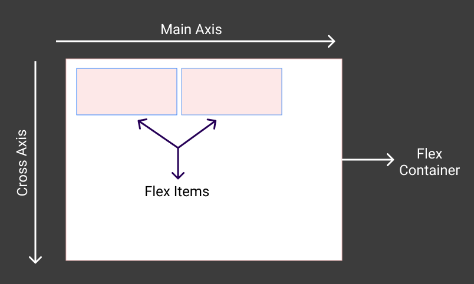

## CSS FLEXBOX


**What's this?**
Flexbox is a css box model to easily layout, align and distribute space among items withing a container either horizontally or vertically.

If your think you feel more comfortable reading Bangla explanation here is my another article **[Learn CSS Flexbox in an interesting way!](https://jisanmia.medium.com/learn-css-flexbox-in-an-interesting-way-3ed3c826efb9)** explained in Bangla

## Before get started we need to know some of the flexbox basics:

- In flexbox, the element or container which wraps all the children elements or items is called _flexbox container_ and childrens or each children elements/items are called _flexbox items_.
- Flex container has their own properties and values
- Same goes to children, also flex items/childrens has their own properties and values
- In flexbox, there are two axis, they are _Main axis_ and _Cross axis_.
- To make a flex container `display: flex;`
- By default, `flex-direction` is row. We can change the flex-direction to
  
  ```css
  flex-direction: row || row-reverse || column || column-reverse
  ```
- When `flex-direction: column || column reverse` one thing happens here, _main axis_ come into the place of _cross axis_ and _cross axis_ take place of _main axis_





## Available properties for Flex container

- Obviously, to make a container flex container we need to write `display: flex`
- To change the directions of flex items there is-

  ```css
  flex-direction: row || row-reverse || column || column-reverse
  ```

- `flex-wrap: wrap;` makes its container to wrap all its items inside the container and the overflow items take place in a new line.
   - by default, _`flex-wrap: nowwrap;`_ overflows the container
   - _`flex-wrap: wrap-reverse`_ wrap in reverse way

- There is another property which control the items flow by combining _flex-direction_ and _flex-wrap_ property values. Eg.
   - `flex-flow: row-reverse wrap;`


### Main axis alignment properties

---

- _`justify-content`_ property defines how the remaining space of content of main-axis should be distributed in main-axis.
   - _`justify-content: flex-start (default)`_ move/align the content to the start
   - _`justify-content: flex-end `_ move/align the content to the end
   - _`justify-content: center`_ move/align the content in the center
   - _`justify-content: space-around`_ space around each items equally from the remaining space
   - _`justify-content: space-between`_ give space between every items
   - _`justify-content: space-evenly`_ space equally in every items


### Cross axis alignment properties

---

- _`align-items`_ property defines how the remaining space of items(alignment content) of cross axis should be distributed in cross axis.
   - _`align-items: stretch`_ default
   - _`align-items: flex-start`_ align items to the start
   - _`align-items: flex-end`_ align items to the end
   - _`align-items: center`_ align items to the center
  
- _`align-content`_ property defines how the remaining space of the full content should be distributed in cross axis.
   - _`align-content: flex-start`_ default. align content to the start in cross-axis
   - _`align-content: flex-end`_ align content to the end
   - _`align-content: center`_ align content to the center
   - _`align-content: space-around`_ space around each items equally from the remaining space
   - _`align-content: space-between`_ equal space between items
  - _`align-content: space-evenly`_ equal space around items


## Also there are some properties for flex items/children. Let's explore them

- _`order`_ property defines its/items order or sequences. Values of order property must be an integer
   - _`order: 0`_ (default) by default each items has the value 0
   - _`order: 1 | 2 | 3 | etc.`_ Item orders from the lowest order number to the largest order number.
  
- _`flex-grow`_ property of a flex item defines how items should grow (চউরা হবে)
   - _`flex-grow: 0`_ default
   - _`flex-grow: 1`_ each item grows equally to fit the container width in main-axis.

- _`flex-shrink`_ property defines if items should shrink or not or ছোট হবে কি হবে না তা ডিফাইন করে।
   - _`flex-shrink: 1`_ default. means means it'll shrink to fit into the container width
   - _`flex-shrink; 0`_ means it won't shrink

- _`flex-basis`_ alternative of _`min-width`_ property in flexbox layout. We use _`flex-basis`_ for responsiveness.
   - _`flex-basis: 33.33%`_ you know how to set width in css

- And lastly but not least there is another property which combines _`flex-grow`_, _`flex-shrink`_ and _`flex-basis`_ into one property and should be written there values separated by spaces. The property name is _`flex`_
   - _`flex: 1 1 33.33%`_ flex-grow value | flex-shrink value | flex-basis value


---

## Let's create national flag of Bangladesh using css flexbox
 

It won't take more than just 2 minute to create the flag. I'll show you step by step

1. HTML part: create html boilerplate code by typing ! and hit tab on vscode. 

2. Inside body tag
   ```html
   <div class="rectangle">
      <div class="circle"></div>
   </div>
   ```
3. Inside head tag
   ```css
   .rectangle{
      background-color: #00684D;
      width: 500px;
      height: 300px;
      border-radius: 5px;
      margin: 0 auto;
      
      // this flex-box code do the main part
      display: flex;
      justify-content: center;
      align-items:  center;
   }
   .circle{
      width: 220px;
      height: 220px;
      margin-right: 45px;
      border-radius: 50%;
      background-color: #E72D41;
   }
   ```
### I know you got your expected output at the same time now you understand what's happening on the code. If not then try reading it carefully again.
### Okay, if you think this _hijibiji_ English is not understandable to you then Guess What! [Learn With Sumit](https://www.youtube.com/c/LearnwithSumit) has a wonderful course on CSS FLEXBOX in bangla where I also got clarified about this topic. The course is available for completely free both on [youtube](https://www.youtube.com/watch?v=kRS5ficucNM) and [udemy](https://www.udemy.com/course/css-flexbox-crash-course-in-bangla/)  about css flexbox
